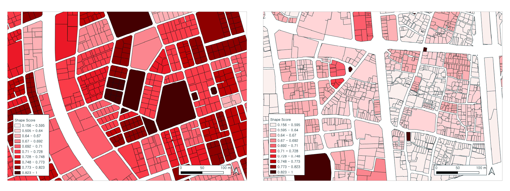
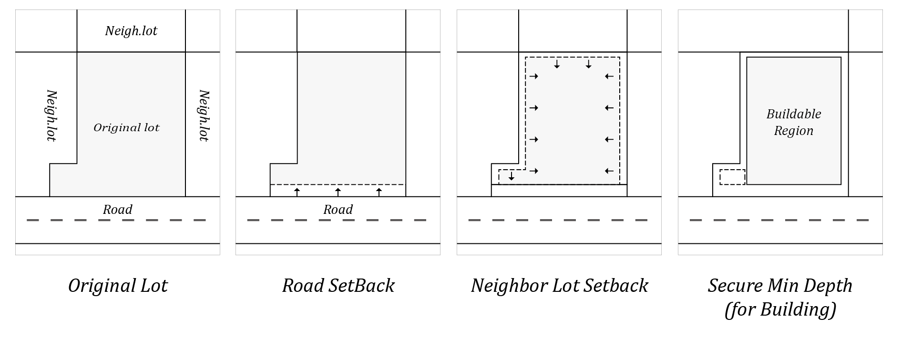
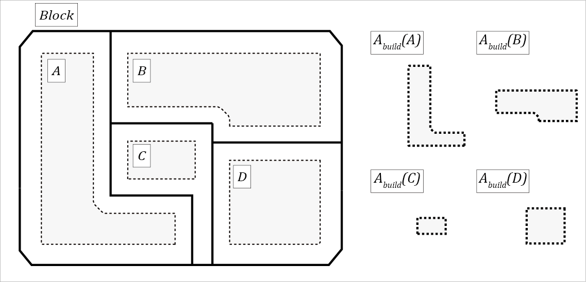
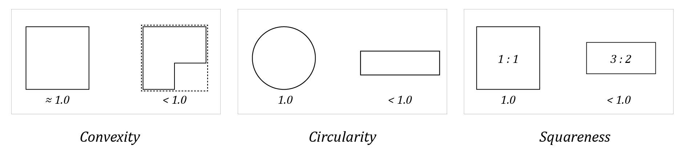
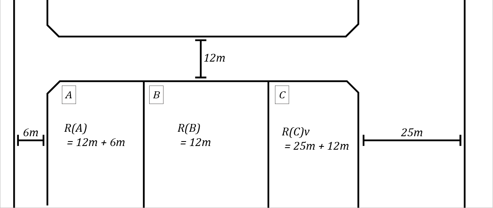
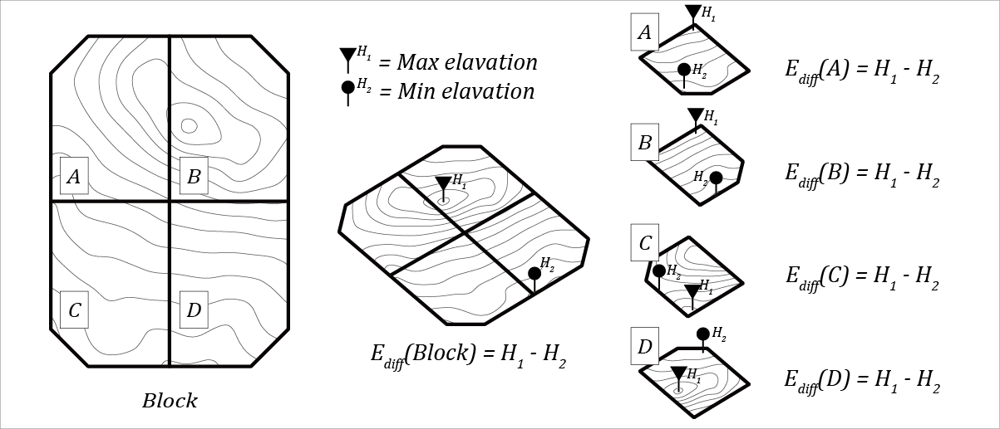

# A Geometry-Based Computational Assessment of Parcel-Level Redevelopment Feasibility in Seoul

> Implementation of the methodology proposed in *"A Geometry-Based Computational Assessment of Parcel-Level Redevelopment Feasibility in Seoul"* — an automated system that evaluates urban parcel layouts using geometry-based scoring metrics within the Rhino/Grasshopper environment.

<p align="center">
  
</p>
<p align="center"><i>Figure 6. Evaluation results visualized on Seoul district maps</i></p>

---

## Overview

Urban planners in Seoul face the challenge of evaluating large-scale parcel layouts efficiently and consistently. This project automates the evaluation process by:

1. **Reading cadastral data** from Korean national GIS shapefiles
2. **Generating blocks** by grouping spatially adjacent lots using graph-based connectivity analysis
3. **Evaluating each block** across four independent geometric scoring dimensions
4. **Exporting scored results** back to shapefiles for GIS integration

The system runs inside **Rhino 3D + Grasshopper**, leveraging Rhino's geometry kernel for robust spatial operations.

---

## Scoring Methodology

Each block is evaluated with four normalized scores (0.0 – 1.0):

### 1. Region Score — Buildable Area Efficiency

Measures how efficiently lots within a block can be developed by computing the ratio of buildable area after applying legal setbacks.

<p align="center">
  
</p>
<p align="center"><i>Figure 4. Buildable region derivation: Original Lot → Road Setback → Neighbor Lot Setback → Buildable Region</i></p>

<p align="center">
  
</p>
<p align="center"><i>Figure 1. Block-level buildable area computation for lots A, B, C, and D</i></p>

### 2. Shape Score — Region Shape Index (RSI)

Evaluates lot shape quality through a weighted combination of three geometric metrics:

<p align="center">
  
</p>
<p align="center"><i>Figure 5. Three shape metrics: Convexity (30%), Circularity (40%), and Squareness (30%)</i></p>

| Metric | Weight | Formula | Ideal |
|--------|--------|---------|-------|
| Convexity | 0.3 | `Area / ConvexHullArea` | 1.0 (no concavities) |
| Circularity | 0.4 | `4 * pi * Area / Perimeter^2` | 1.0 (circle) |
| Squareness | 0.3 | Based on bounding box aspect ratio | 1.0 (square) |

### 3. Road Score — Road Access Index

Quantifies road accessibility using cadastral road condition codes (01–12), mapping each to a normalized score. Corner lots with multiple road frontages receive higher scores.

<p align="center">
  
</p>
<p align="center"><i>Figure 2. Road frontage width computation for lots A, B, and C</i></p>

### 4. Topography Score — Elevation Variation

Assesses terrain flatness within each block using DEM (Digital Elevation Model) data.

<p align="center">
  
</p>
<p align="center"><i>Figure 3. Elevation relief computation at block and lot levels</i></p>

---

## Project Structure

```
parcel_layout_evaluation_analysis/
├── grasshopper/
│   ├── main.py                 # Entry point
│   ├── block_generator.py      # Groups adjacent lots into blocks (NetworkX)
│   ├── parcel_evaluator.py     # Orchestrates four scoring modules
│   ├── shape_manager.py        # Shapefile I/O with encoding detection
│   ├── units.py                # Core data classes (Parcel, Lot, Block, LayoutScore)
│   ├── utils.py                # Geometry utilities (Rhino + Clipper)
│   ├── constants.py            # Configuration parameters
│   ├── visual_debugger.gh      # Grasshopper visual debugger component
│   └── scorers/
│       ├── region.py           # Buildable area efficiency scorer
│       ├── shape.py            # Region Shape Index (RSI) scorer
│       ├── road.py             # Road access scorer
│       └── topo.py             # Topography/elevation scorer
├── input_data/                 # Input GIS data (shapefiles + DEM)
├── output_data/                # Evaluated block shapefiles
└── docs/                       # Research paper and figures
```

---

## Pipeline

```
Shapefile (Cadastral Data)  +  DEM Raster
              │                     │
              v                     │
     ShapefileManager               │
  (parse lots & roads)              │
              │                     │
              v                     │
      BlockGenerator                │
  (spatial join + graph             │
   connected components)            │
              │                     │
              v                     │
      ParcelEvaluator  <────────────┘
       ├─ RegionScorer
       ├─ ShapeScorer
       ├─ RoadScorer
       └─ TopoScorer
              │
              v
     Output Shapefile
  (blocks with 4 scores)
```

---

## Requirements

This project runs inside the **Rhino 3D / Grasshopper** scripting environment. The following dependencies are required:

- **Rhino 7+** with Grasshopper
- **Python libraries** (available within Rhino's Python environment):
  - `geopandas` — Geospatial data operations
  - `shapely` — Geometric computations
  - `networkx` — Graph-based block grouping
  - `pyshp` — Shapefile I/O

---

## Input Data

| Data | Format | Description |
|------|--------|-------------|
| Cadastral parcels | Shapefile (`.shp`) | Korean national land parcel data (AL_D194) |
| Digital Elevation Model | GeoTIFF (`.tif`) | 10m resolution DEM raster |

---

## Output

The system exports a shapefile containing evaluated blocks with the following attribute fields:

| Field | Description | Range |
|-------|-------------|-------|
| `BLOCK_ID` | Unique block identifier | — |
| `REGION` | Buildable area efficiency score | 0.0 – 1.0 |
| `SHAPE` | Region Shape Index score | 0.0 – 1.0 |
| `ROAD` | Road access score | 0.0 – 1.0 |
| `TOPO` | Topography score | 0.0 – 1.0 |

---

## Usage

1. Open `grasshopper/visual_debugger.gh` in Rhino/Grasshopper
2. Set the input shapefile path and output save path
3. Run `grasshopper/main.py` through the GhPython component
4. The evaluated blocks are saved as a new shapefile in `output_data/`

---

## Citation

If you find this work useful, please consider citing:

```bibtex
@article{byun2025geometry,
  title     = {A Geometry-Based Computational Assessment of Parcel-Level Redevelopment Feasibility in Seoul},
  author    = {Byun, Sanghoon and Park, Dongjun and Kang, Bumjun},
  year      = {2025}
}
```

---

## Authors

| | Name | Role | GitHub |
|---|------|------|--------|
|  | **Sanghoon Byun** | Author | [@969flash](https://github.com/969flash) |
|  | **Dongjun Park** | Author | [@gbjun7333](https://github.com/gbjun7333) |
| | **Bumjun Kang** | Advisor | [Homepage](https://bumjoon.github.io/) |

---

## Acknowledgments

This research was conducted at the **[LAUS (Lab. Architectural & Urban Space)](https://architecture.snu.ac.kr/research/lab-architectural-urban-space/)**, Department of Architecture and Architectural Engineering, **Seoul National University**, under the supervision of Prof. Bumjun Kang.
